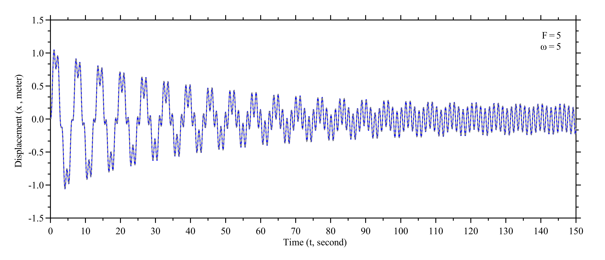
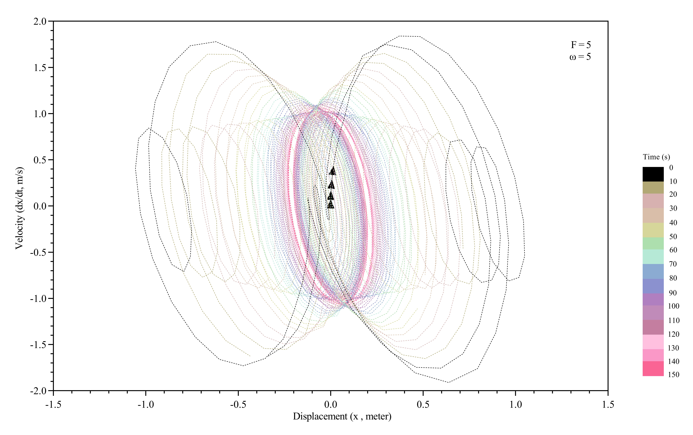
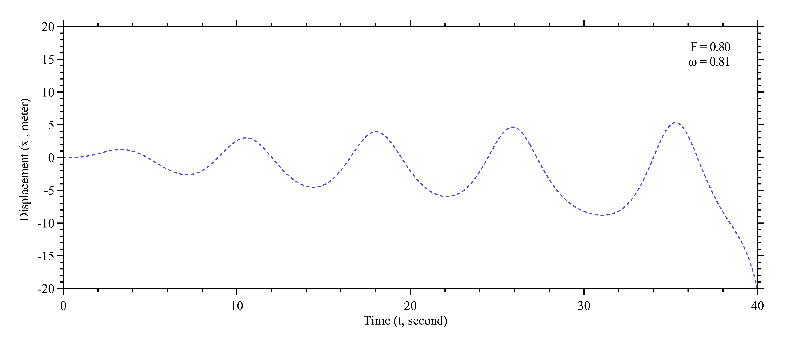
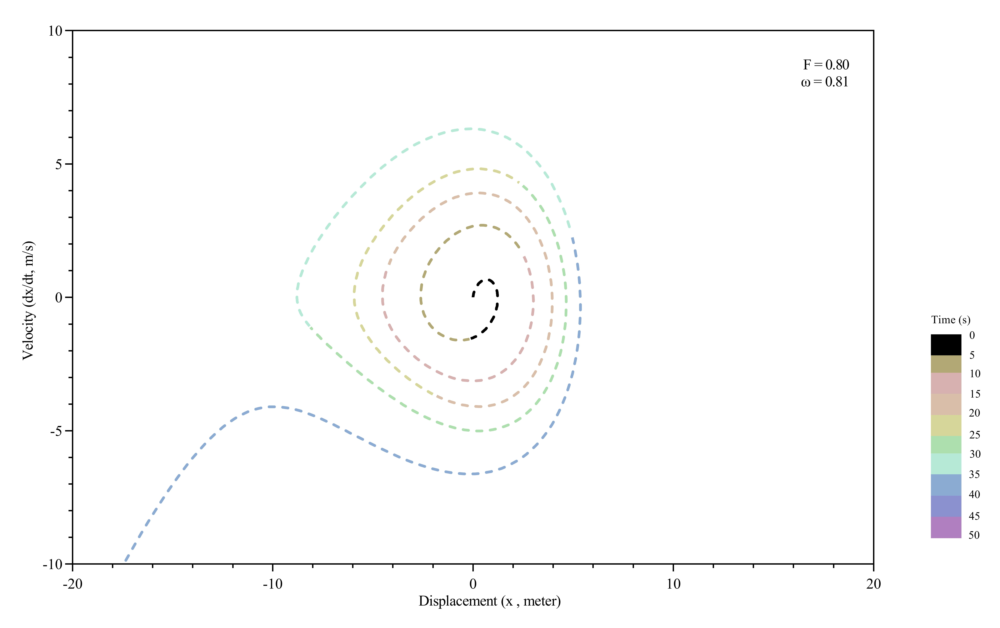
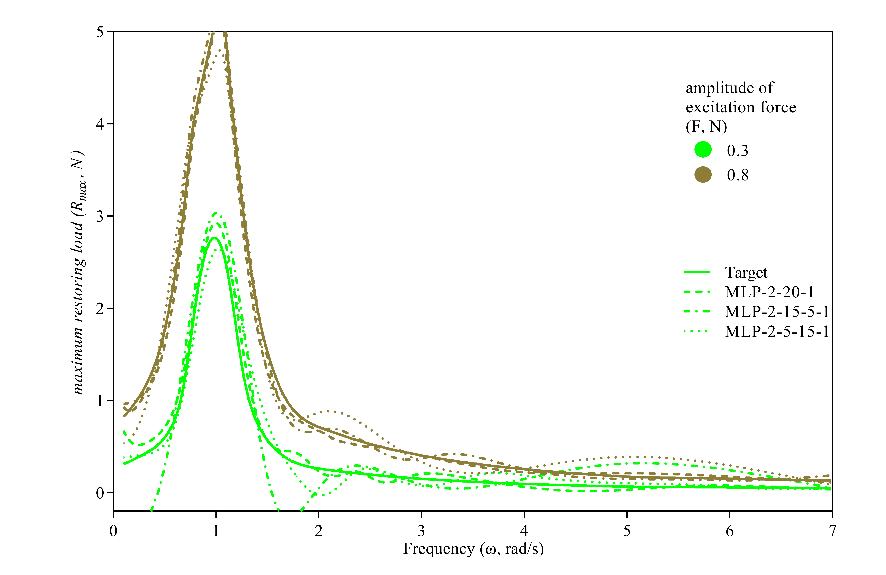
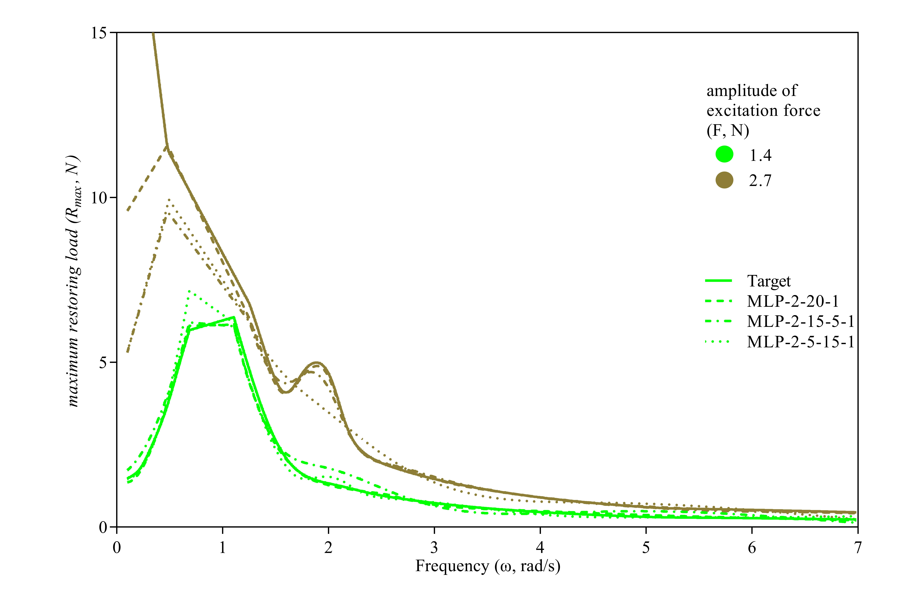
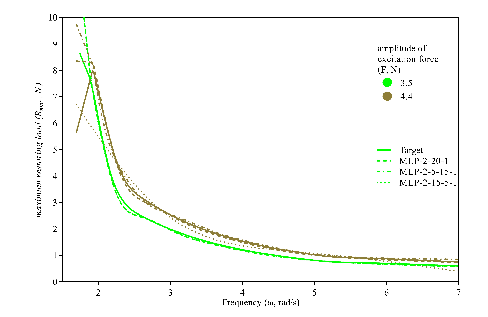
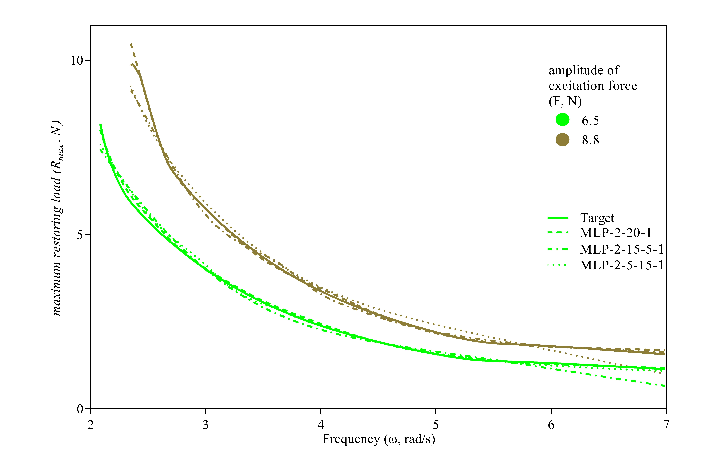

**Exercise ‘VAC-2021-42 - PhD Position in CIMNE MARINE’**

The goal of the exercise is to develop a neural network capable of predicting the maximum restoring load of the non-linear mass-spring-damper system shown in the figure:
 
The system responds to the following differential equation:
$M \frac{d^2x}{dt^2} + D \frac{dx}{dt} + K \cdot x = Fe$
Where x is the displacement of the mass (in metres), M is the Mass of the system, D is damping coefficient, K the restoring term and Fe the excitation force. The values of those terms are given below:
M=1 kg
D=0.05 kg·s
K(x)=1+0.1x N/m
Fe=F·sin(ωt)  N

The input parameters of the system are the frequency, ω, and amplitude, F, of the excitation force. The output of the system is the maximum restoring load. The range of applicability must be: F∈[0.1,10]  N and w∈[0.1,10]  rad/s

**Part 1: Solution of ODE**

By inserting the values of the given terms, the following differential equation is obtained:

|d2xdt2+0.05 dxdt+(1+0.1x)·x=F·sinωt|(1)|
| - | - |

This equation is a second-order nonlinear ordinary differential equation and the following initial values are assumed for it:

|x0=0,	x'(0)=0|(2)|
| :-: | - |

The equation has been solved numerically by MATLAB software and related codes are presented in appendix. The behavior of the system, for some value of ω is unstable, due to resonance phenomenon. For example, the behavior of the system over time is shown for a stable state (F=5 and ω=5) in Figure 1 and for an unstable state (F=0.8 and ω=0.81) in Figure 2.

(a)

(b)

**Fig. 1** the stable behavior of non-linear mass-spring-damper system (F=5 & ω=5): (a) displacement of mass (meters), as a function of the time (second); (b) velocity of mass, dx/dt, (m/s), as a function of its displacement.

(a)

(b)

**Fig. 1** the unstable behavior of non-linear mass-spring-damper system (F=0.8 & ω=0.81): (a) displacement of mass (meters), as a function of the time (second); (b) velocity of mass, dx/dt, (m/s), as a function of its displacement.

After obtaining the displacement values of mass, the values of restoring load of the non-linear mass-spring-damper system are calculated from the following equation and its maximum value is determined:

|R=|1+0.1xx||(3)|
| :-: | :-: |

**Part 2: Establishing the Database**

As the data have to be handled through Machine Learning approaches, the quality of the dataset is one of the dominant aspects to assure the accuracy of the predictions. The database should contain a sufficient number of different input values, and more data is needed at values where system behavior is more sensitive. Therefore, an appropriate understanding of the system behavior must be found. For this purpose, how the maximum restoring load (Rmax) changes in terms the frequency (ω) and amplitude (F) of the excitation force, are plotted in Figures 3 and 4, respectively.

**Fig. 3** Maximum restoring load (Rmax , N), as a function of frequency (ω , rads) for different values of excitation force amplitude (F , N)

**Fig. 4** Maximum restoring load (Rmax , N), as a function of excitation force amplitude (F , N) for different values of frequency (ω , rads) 

As shown in Figures 3 and 4, the changes maximum restoring load in the range of [0.1, 4] of frequency (ω) and [0.1, 3] of amplitude (F) are severe and require more data in these intervals. Also, the data related to unstable states should be removed (a neural network can be trained to estimate the stability of the system as well, but we skip it due to lack of time.). Therefore, the effective number of values of the parameters are collected in Table 1.

<table><tr><th colspan="6"><b>Table 1.</b> the number of selected values for parameters</th></tr>
<tr><td></td><td colspan="4"><b>Parameters</b></td><td rowspan="1">Total Number of Data</td></tr>
<tr><td></td><td colspan="2">frequency (ω)</td><td colspan="2">amplitude (F)</td></tr>
<tr><td>Range</td><td>[0.1, 4)</td><td>[4, 10]</td><td>[0.1, 3)</td><td>[3, 10]</td></tr>
<tr><td>Number of Data in the range</td><td>400</td><td>200</td><td>100</td><td>50</td><td></td></tr>
<tr><td>Number of Data for each parameters</td><td colspan="2">600</td><td colspan="2">150</td><td>90,000</td></tr>
<tr><td colspan="3">Number of unstable state</td><td colspan="3">15,549</td></tr>
<tr><td colspan="3"><b>Total Number of effective Data</b></td><td colspan="3"><b>74,451</b></td></tr>
</table>

In this way, a database of two inputs (ω & F)  and one output (Rmax) with 74,451 rows of data was provided for developing neural networks.

**Part 3: Artificial Neural Networks - Multilayer perceptron (MLP)**

To learn and next estimate the maximum restoring load, multilayer perceptron neural networks have been adopted. In the following, the impact of the relevant hyperparameters on the performance of MLP is provided. With hyperparameters, here we mean the algorithm-dependent parameters that control the learning process.

McCulloch and Pitts first introduced the ANNs as a powerful predictive tool (McCulloch and Pitts, 1943). ANNs are a programming paradigm which tries to mimic the brain structure; they are broadly employed in artificial intelligence problems, from simple pattern-recognition tasks to advanced symbolic manipulation. ANN-based models process the available data during a training stage, assessing the network output to efficiently and accurately match some available targets in case of a supervised approach, like the one here adopted resting on the results included in the dataset. ANNs can be used for modeling complex systems in virtually any science (Pal and Mitra 1992; Ruck, Rogers, and Kabrisky 1990).

MLP is a class of ANNs, and stands as an evolution of the perceptron neural network originally developed in the 1960s, see (Noriega 2005). MLP provides a nonlinear map f:Rk⟶Rh, in case of an input layer made of k neurons (input values) and an output layer made of h neurons (output values); it also consists of an arbitrary number of hidden layers, with a variable number of neurons. The neurons are storage cells for scalar values, obtained by an activation function applied to the neuron values in the previous layer.

For our problem, a preliminary analysis has been performed to identify the optimal architecture of the MLP, in terms of number of neurons in the hidden layers to accurately describe the correlation between input and output of the analyzed dataset. In this regard, one-hidden-layer and two-hidden-layer ANNs have been investigated; to speed-up the optimization procedure, only 5% of the data has been adopted at this stage. To this aim, (Gandomi et al. 2013) suggested that the ratio between the number of data and the number of input and output variables should be greater than five to attain an appropriate performance of MLP; in the present case, the mentioned ratio is so much larger than the minimum value suggested.

Figure 5 provides a comparison of the behaviors of all the considered architectures, at the end of training. Results are reported in terms of the root mean square error (RMSE), given by:

|RMSE=1ni=1nRmi , D-Rmi ,  ANN 2|(4)|
| - | - |

which has been assumed as the loss function to be minimized during the training. In Eq. (4): n is the total number of data; for the i-th model, Rmi , D is the maximum restoring load obtained with the MATLAB software (in Database) while Rmi ,  ANN  is the value estimated through the ANN algorithm. 

To assess the effects of the hyperparameters on the ANN accuracy, the plot in Figure 5 shows the final value of RMSE as a function of the total number of neurons in the MLP. The continuous line represents the solution obtained with the one-hidden-layer ANN, which is obviously uniquely defined by the number of neurons in the layer itself; the dashed lines represent instead the solutions for the two-hidden-layer ANNs, and for each of them the label in the chart represents the number of neurons in its second hidden layer. Each point in this graph has been computed as the average value out of ten repetitions of the training process, to also assure robustness against stochastic effects. What turns out from this analysis is that the ANN featuring one-hidden-layer only, almost surely provides the best performance. Furthermore, for a number of neurons larger than 20 there is no noticeable improvement in the final value of the RMSE. Accordingly and in order to minimize the computational costs, the 2-20-1 ANN architecture has been adopted henceforth. However for comparison in the rest of the steps, 2-15-5-1 and 2-5-15-1 two-hidden-layer neural networks are also selected.

**Fig. 5** MLP: dependence of the RMSE at the end of training on the total number of neurons in the ANN, featuring either one or two hidden layers.

70% of the total dataset has been employed for training, 15% for validation and the remaining 15% for testing. Therefore, the numbers of samples used for the various stages of the MLP-based analysis are as follows: out of the total 74,451 data, 52,115 are used for training, 11,168 for testing, and 11,168 for validation.

**Part 4:  Results**

In this Section, the performances of the different MLP are investigated. As metrics for the said performances, the following statistical indices have been adopted to measure the discrepancy between the observed and the predicted values of the maximum restoring load:

|R2=i=1nRmi , D-Rm , DRmi ,  ANN -Rm ,  ANN i=1nRmi , D-Rm , D2i=1nRmi ,  ANN -Rm ,  ANN 22|(5)|
| - | - |
|SI=RMSERm , D|(6)|
|BIAS=1ni=1nRmi , D-Rmi ,  ANN |(7)|

R2, SI, and BIAS being, respectively, the coefficient of determination, the scatter index, and the standard bias. Besides these indices, the RMSE introduced in Eq. (4) has been adopted too. In these equations: i=1,…,n is an index running over the instances in the dataset; Rmi , D is the numerical value of the maximum restoring load furnished by the MATLAB software, while Rmi ,  ANN  is the corresponding value provided by the trained ML tool; the overbar stands for the average value of the corresponding variable.

Table 2 gathers the values of all the statistical indices introduced above to assess the performance of each MLP neural networks. It can be seen that 8-20-1-MLP is more accurate than 8-15-5-1-MLP and 8-5-15-1-MLP in catching the response, as shown by the R2, RMSE, SI, and BIAS values. The same trend is shown also in the parity plots given in Figure 6, where the estimations of the maximum restoring load of the non-linear mass-spring-damper system are compared with the truth values. Output provided by 8-20-1-MLP is shown to be much less scattered than the others, and the linear interpolation of all the pairs of results is well aligned with the (perfect fit) bisector of the quadrant. In spite of the relative small value of the BIAS, due to the fact that each single term in the sum is purposely taken with its own sign, 8-5-15-1-MLP is the model performing worse, as reported by the large scatter and also by the deviation from the perfect fit line of the linear interpolant.

The goodness of fit of the results has been also studied: Figure 7 provides a comparison between the true valued and the foreseen maximum restoring load of the non-linear mass-spring-damper system. For this comparison, only few number of the instances in the dataset has been selected, so as to provide a clear view of the quality of data fitting. It results that the maximum restoring load computed by the ML techniques matches relatively well their true counterparts; the (minor) scattering around them is obviously in accordance with the results reported in Figure 7.

|**Table 2.**  Performance of the MLP algorithms, in term of the adopted statistical indices|||||
| - | :- | :- | :- | :- |
|ANN|R2|RMSE|SI|BIAS|
|2-20-1 MLP|0\.9731|0\.2928|0\.1825|2\.4505e-04|
|8-5-15-1 MLP|0\.9164|0\.4828|0\.3007|-1.4182e-04|
|8-15-5-1 MLP |0\.9542|0\.3405|0\.2141|-9.5641e-04|

**Fig. 6** Performances of the ML algorithms: parity plots showing the ML output against the corresponding truth numerical values for: (a) all the MLP methods and regarding all the data; (b) 2-20-1-MLP regarding test and validation data; (c) 2-5-15-1-MLP regarding test and validation data; (d) 2-15-5-1-MLP regarding test and validation data.

(a)

(b)

(c)

(d)

**Fig. 7** Performance of the MLP algorithms: comparison between the true numerical results and the forecasts provided by the three MLP for some data, in terms of the maximum restoring load of the non-linear mass-spring-damper system.

***References***

McCulloch, W.S. and Pitts, W., (1943). A logical calculus of the ideas immanent in nervous activity. The bulletin of mathematical biophysics, 5(4), pp.115-133. 

Pal, S. K., & Mitra, S. (1992). Multilayer perceptron, fuzzy sets, classifiaction. IEEE Trans. Neural Netw. 3 (5), 683–697.

Ruck, D. W., Rogers, S. K., & Kabrisky, M. (1990). Feature selection using a multilayer perceptron. Journal of Neural Network Computing, 2(2), 40-48. 

Noriega, L. (2005). Multilayer perceptron tutorial. School of Computing. Staffordshire University.

Gandomi, A. H., Yang, X. S., Talatahari, S., & Alavi, A. H. (2013). Metaheuristic algorithms in modeling and optimization. In *Metaheuristic applications in structures and infrastructures*, Elsevier: Amsterdam, The Netherlands, pp. 1-24.

